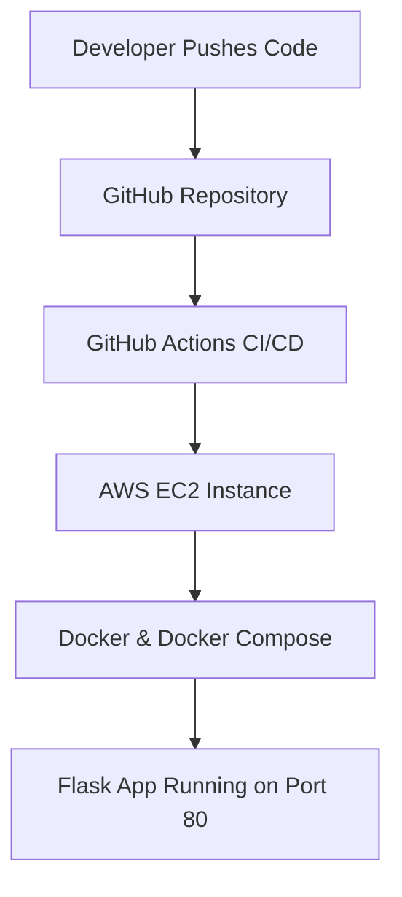

# Project 5 — CI/CD Pipeline with GitHub Actions & AWS EC2

## Automated Deployment of a Dockerized Flask Application

---

## 📌 Project Overview

This project demonstrates a **complete CI/CD pipeline** that automatically builds and deploys a **Dockerized Flask application** to an **AWS EC2 instance** using **GitHub Actions**.

Every push to the `main` branch triggers a pipeline that securely connects to EC2 via SSH, pulls the latest code, rebuilds Docker images, and restarts the application — with **zero manual intervention**.

This project reflects real-world DevOps practices used in production environments.

---

## 🎯 Objectives

- Build a simple Flask web application
- Containerize the application using Docker
- Define multi-container orchestration using Docker Compose
- Implement CI/CD using GitHub Actions
- Deploy automatically to AWS EC2 on every GitHub push
- Secure deployment using SSH keys and GitHub Secrets
- Follow DevOps best practices (separation of concerns, automation, security)

---

## 📋 Prerequisites

- AWS Account with EC2 access
- GitHub Account with repository access
- EC2 instance running Ubuntu with Docker installed
- SSH key pair for EC2 access
- Basic knowledge of GitHub Actions workflows
- Docker and Docker Compose installed locally (for testing)

---

## 🧩 Architecture



---

## 🛠️ Tech Stack

- **Cloud Provider:** AWS
- **Compute:** Amazon EC2 (Ubuntu)
- **Application:** Python Flask
- **Containerization:** Docker
- **Orchestration:** Docker Compose
- **CI/CD:** GitHub Actions
- **Security:** SSH key-based authentication, GitHub Secrets

---

## 🚀 CI/CD Workflow

1. Developer pushes code to `main` branch
2. GitHub Actions pipeline is automatically triggered
3. Pipeline securely connects to EC2 via SSH using secrets
4. Latest code is pulled from GitHub repository
5. Docker images are rebuilt with latest changes
6. Containers are restarted using Docker Compose
7. Updated application becomes live automatically
8. Deployment status is reported back to GitHub

---

## 🔧 GitHub Actions Setup

### Required Secrets
Configure the following secrets in your GitHub repository:
- `EC2_HOST` — EC2 instance public IP or hostname
- `EC2_USER` — SSH username (typically `ubuntu`)
- `EC2_SSH_KEY` — Private SSH key content for EC2 access
- `EC2_APP_DIR` — Absolute path on EC2 where this repo is cloned (e.g., `/home/ubuntu/project-05-cicd-flask-ec2`)

### Secrets Configuration Steps
1. Go to Repository → Settings → Secrets and variables → Actions
2. Click "New repository secret"
3. Add each secret with its corresponding value

### Workflow File Location
The GitHub Actions workflow is located at:
```
.github/workflows/deploy.yml
```

Note: This repo includes a disabled reference workflow (`deploy.yml.disabled`) used during development; it contains **no hardcoded secrets** and uses GitHub Secrets placeholders.

---

## 🔐 Security Design

- Dedicated SSH key for CI/CD automation (separate from personal EC2 key)
- SSH private key stored securely in GitHub Actions Secrets
- No credentials or secrets committed to the repository
- EC2 security group restricts SSH access to trusted sources
- Key-based authentication only (no passwords)

---

## 📁 Repository Structure

```
project-05-cicd-flask-ec2/
├── app.py
├── requirements.txt
├── Dockerfile
├── docker-compose.yml
├── .github/
│   └── workflows/
│       └── deploy.yml
└── README.md
```

---

## 🧪 Verification & Testing

- ✅ Local testing using `docker-compose up --build`
- ✅ GitHub Actions workflow verified via Actions tab
- ✅ Application accessible via EC2 public IP
- ✅ Deployment confirmed after multiple push-based updates

---

## 📌 Resume Highlights

- Implemented an end-to-end CI/CD pipeline using GitHub Actions and AWS EC2
- Automated deployment of a Dockerized Flask application via secure SSH
- Used Docker and Docker Compose for consistent application delivery
- Managed secrets securely using GitHub Actions Secrets
- Applied DevOps best practices including automation, separation of concerns, and infrastructure security

---

## 🏷️ Tags

AWS · EC2 · Docker · Docker Compose · GitHub Actions · CI/CD · DevOps · Flask
